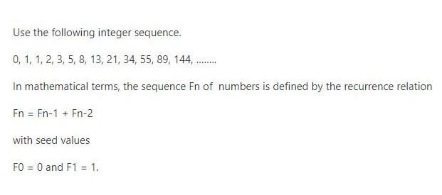
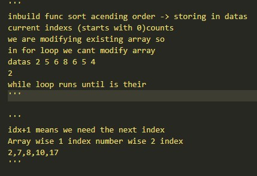
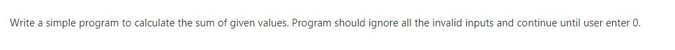

# Tasks

InClass Mathematical TASKS

### [What is FIbonacci ?](https://en.wikipedia.org/wiki/Fibonacci_number)
    The Fibonacci sequence is a set of numbers that starts with a one or a zero, followed by a one

-----------------------------------
###     T A S K - 1 
-----------------------------------
- fib_dynamic.py    - FIbonacci sequence in DYNAMIC WAY
- fib_recursion.py  - FIbonacci sequence in RECURSION WAY

-----------------------------------
###     T A S K - 2 
-----------------------------------
- task2.py    - InClassAssessment

-----------------------------------
###     T A S K - 3 
-----------------------------------
- task3.py    - InClassAssessment

